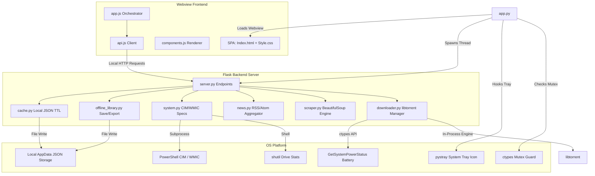

# Arcadia Core: System Architecture & Technical Analysis

**Project Name:** Arcadia Core  
**Subtitle:** *A Gaming Universe*  
**Repository:** [GitHub Repository](https://github.com/OK-ALI/Arcadia)  
**Platform:** Windows Desktop Application  

---

## 1. Executive Summary

**Arcadia Core** is a custom Windows desktop gaming hub that brings game discovery, catalog indexing, live news feed, system hardware diagnostics, and a built-in BitTorrent downloader into a unified desktop dashboard. 

Rather than wrapping a simple website, the application implements a hybrid **desktop-webview architecture**:
- A **Python**-based backend runs a background **Flask** server, handles system CIM/WMIC queries, scrapes gaming data, and hosts an in-process **libtorrent** download engine.
- A **native Windows webview** hosts the frontend Single Page Application (SPA), written in vanilla **HTML5**, **CSS3**, and **JavaScript (ES6)**.
- Local capabilities (such as folder dialog pickers) are exposed via a pywebview native JS API bridge, and background operations remain active in the Windows system tray even when the window is closed.

This analysis details the technical layout, component interactions, runtime lifecycles, and engineering strengths of the project.

---

## 2. System Architecture

The overall design represents a micro-service architecture run entirely on the local machine:

### 2.1 The Application Launcher (`app.py`)
`app.py` coordinates the bootstrap and shutdown sequence of the application:
1. **Single-Instance Mutex Guard**: Uses Windows `ctypes.windll.kernel32.CreateMutexW` with a global name (`Global\ArcadiaCoreSingleInstance`). If the mutex is already occupied (indicating another instance is running), the launcher sends a POST request to `/api/app/focus` to restore the active instance's window, then terminates.
2. **Server Threading**: Launches the Flask server on a background thread (`run_server`) binding to localhost (`127.0.0.1:5000`).
3. **Webview Initialization**: Blocks until the Flask port is responsive, then uses `webview.create_window` to load the client SPA. It injects a `NativeBridge` class exposing a `choose_folder` method (using `create_file_dialog` to trigger Windows folder pickers from JS).
4. **Tray Controller**: Hooks into `pystray.Icon` with a custom-generated icon image and background polling thread (`update_status_loop`). When a user closes the webview window, the window close event is intercepted, and the window is hidden instead of destroyed. Active downloads run in the tray until the user right-clicks the tray icon and selects **Quit Arcadia**.

---

## 3. Backend Component Breakdown

The python backend is split into logical modules under the [backend](file:///d:/Projects/Arcadia/backend) folder:

### 3.1 Server Engine (`server.py`)
Provides REST API endpoints that the frontend calls using standard `fetch` methods. Important endpoints include:
- **Search & Catalog**: `/api/search`, `/api/latest`, `/api/popular`, `/api/upcoming`, and `/api/game/<slug>`.
- **A-Z Catalog Index**: `/api/library` and `/api/library/index` (coordinates background parsing of the entire catalog).
- **Artwork & Metadata Hydration**: `/api/library/artwork` and `/api/library/requirements` (fetches cover images and requirements progressively).
- **Download Management**: `/api/torrent/status`, `/api/torrent/control`, `/api/torrent/settings`, and `/api/torrent/priority`.
- **Native Operations**: `/api/system/specs`, `/api/system/drives`, `/api/system/ping`, and `/api/offline/*` for backup export/import and offline states.

### 3.2 In-Process Downloader (`downloader.py`)
The download manager uses **libtorrent** (a native C++ BitTorrent library) loaded directly into Python via the `libtorrent` library. Key behaviors:
- **No External Daemon**: All network sockets, peer connections, and disk I/O are handled inside the Arcadia process, avoiding heavy background RPC utilities like `aria2c` or `transmission-daemon`.
- **Fastresume Storage**: Periodically calls `handle.save_resume_data()` and writes `.fastresume` files to the local app data folder on disk. This enables downloads to instantly resume from where they left off upon application relaunch.
- **Battery Safety Guard**: Queries `ctypes.windll.kernel32.GetSystemPowerStatus`. If the device is running on battery power (unplugged) and the charge drops below **20%**, the download engine automatically pauses active downloads and notifies the user to prevent device shutdown.
- **Speed Limits**: Applies upload and download bandwidth constraints dynamically on the active `libtorrent` session.

### 3.3 Dynamic Hardware Scanner (`system.py`)
Performs dynamic scans of the host Windows device:
- **RAM Scan**: Queries usable memory via the Win32 API `GlobalMemoryStatusEx` (`MEMORYSTATUSEX` struct via `ctypes`) and retrieves installed memory by spawning a fast PowerShell command (`Get-CimInstance Win32_PhysicalMemory`).
- **CPU Scan**: Reads `ProcessorNameString` directly from the Windows Registry key `HARDWARE\DESCRIPTION\System\CentralProcessor\0` for fast, zero-dependency CPU discovery.
- **GPU Discovery**: Executes a PowerShell CIM command (`Get-CimInstance Win32_VideoController`) to list all active video cards and calculate their respective VRAM. It includes a fallback to `wmic` for legacy environments and a custom indexing heuristic (`_gpu_score`) to automatically rank the primary discrete card (NVIDIA/AMD) over integrated Intel graphics.
- **Storage Scanner**: Scans drives (`A:` to `Z:`) using Python's `shutil.disk_usage` to retrieve capacity, usage, and remaining free space.

### 3.4 Web Scraper & Parser (`scraper.py`)
Acts as the bridge to the gaming catalog (using `requests` and `BeautifulSoup`):
- **HTML Parsing**: Parses titles, sizes, magnet URLs, direct links, descriptions, and file lists.
- **Steam API Matcher**: If requirement listings on the repack pages are incomplete, it queries the Steam Web API (`store.steampowered.com/api/storesearch` and `appdetails`) using normalized game title matching. It parses minimum and recommended specs, RAM sizes, target graphics cards, and disk space requirements from Steam, merging them into the metadata index.
- **Artwork Caching**: Automatically downloads and cache cover images to the local user folder, translating them into local `/api/offline/media` references to guarantee off-line catalog usability.

### 3.5 Aggregator & Attributors (`news.py`, `official_sources.py`)
- **Live News Feed**: Aggregate news headlines in parallel from RSS/Atom feeds (PC Gamer, GameSpot, IGN, Steam game blogs, console wires). Results are cached for 15 minutes.
- **Official Link Resolver**: Inspects developer, publisher, and publisher networks (Ubisoft, Xbox, Sega, EA, Capcom, Bandai Namco) using verified key-value dictionaries. It displays verified links in the UI, avoiding speculative search engines.

---

## 4. Frontend Component Breakdown

The frontend is structured as a Single Page Application under [frontend](file:///d:/Projects/Arcadia/frontend):

### 4.1 UI Layout & CSS Engine (`index.html`, `style.css`)
- **Modern Styling**: Implements charcoal-dark default themes and a clean light theme using CSS Custom Properties (variables). Custom styling includes glassmorphic dialog modals, progress indicators, fluid layouts, custom scrollbars, and dynamic state buttons.
- **Sidebar Navigation**: Features an expandable and resizable navigation sidebar. Users can hover, collapse, or drag the sidebar border to resize the workspace. Sidebar layout preferences are persisted in `localStorage`.

### 4.2 Application Orchestration (`app.js`, `components.js`, `api.js`)
- **Debounced Search**: Listens to the search bar inputs and delays requests by `400ms` using a debounce timer, preventing rate-limiting on requests.
- **Hydration & Progress Lifecycle**: Cards load immediately using basic text placeholders while cover artwork and system specs hydrate in the background.
- **Spec Compatibility Evaluator**:
  - Automatically parses GPU strings (e.g., `RTX 3070`, `RX 6700 XT`) into performance weight tiers (`Components.parseGpuTier`).
  - Evaluates system specs against game requirements.
  - Dynamically renders color-coded compatibility badges (**Compatible** in green, **Min Specs** in yellow, **Below Specs** in red, **Unknown Specs** in grey).
  - Includes a "Compatible Specs Only" filter toggle that hides failing and unknown games.
- **Estimation Calculator**: Converts connection speeds (Mbps vs MB/s) to calculate estimated download times for the highly compressed repack file size versus the original steam size, reporting estimated bandwidth savings.
- **Pre-download Selectable Checklist**: Before beginning a torrent, the user is presented with a pre-download modal that lists all files in the torrent. Users can toggle checkboxes to select only specific files (e.g., exclude language packs, extras, or bonus tracks). The javascript file helper includes buttons to automatically select only **Required Files** (using regex to filter out `optional`, `bonus`, `ost`, etc.) or **Language Files**.

---

## 5. Packaging & Compilation Specification

The build system compiles the codebase into a portable desktop utility:

### 5.1 PyInstaller Bundle Configuration (`Arcadia.spec`)
The spec file bundles the application:
- **Native DLLs**: Collects binary drivers for `libtorrent` and `webview` via custom helper functions (`collect_dynamic_libs`).
- **Assets Mapping**: Merges folders (`frontend`, `assets`) into the application environment.
- **Hidden Imports**: Forces inclusions for key packages (`libtorrent`, `pythonnet`, `clr_loader`, and platform-specific webview modules like `webview.platforms.winforms` and `webview.platforms.edgechromium`).
- **No Console Window**: Configures `console=False` so the console shell window remains hidden when launching the compiled `Arcadia.exe`.

### 5.2 Inno Setup Installer Compiler (`Arcadia.iss`)
Compiles the PyInstaller build folder into a modern Windows wizard setup:
- **x64 Target**: Specifies `ArchitecturesInstallIn64BitMode=x64` to enforce 64-bit optimizations.
- **Solid Compression**: Configures `Compression=lzma2` and `SolidCompression=yes` to produce a small, optimized setup file (`ArcadiaCoreSetup.exe`).
- **Startup Configs**: Registers desktop icons, start menu folders, and log records.

---

## 6. Technical Assessment & Portability Analysis

### 6.1 Engineering Strengths
1. **Low Footprint Downloader**: Loading `libtorrent` in-process avoids the need to maintain an external downloader process, minimizing memory footprint and process overhead.
2. **Reliable Single-Instance Guard**: The mutex guard combined with background port checking ensures multiple launches restore the existing app window rather than creating duplicated server sockets.
3. **Smart Hardware Matching**: The script goes beyond basic comparison by parsing GPU models into rank tiers and using Steam Web API queries to fill in missing spec details.
4. **Optimized Render Hydration**: Scraping pages is deferred. Requirements and covers are hydrated only for visible elements in the gallery grid.

### 6.2 Areas of Technical Debt & Limitations
1. **Windows Platform Dependency**: CIM queries, `MEMORYSTATUSEX`, system tray status loops, registry checks, power status indicators, and Inno Setup are heavily tied to the Windows OS. Adapting the project for macOS or Linux would require wrapping these calls in OS-specific adapters.
2. **JSON State Serialization**: States (`downloads_state.json`, `offline_library.json`) are rewritten entirely upon change. While atomic replace `os.replace` prevents corruption, thread locks should be consistently used to avoid concurrent read/write conflicts.
3. **Scraper Maintenance**: HTML scraping relies on parsing DOM classes from a third-party source site. Changes to the source site's structure will break the scraper. Integrating a local schema validation step would help identify DOM changes early.

---

## 7. Future Roadmap Recommendations

1. **Abstraction Layer for Specs**: Extract all Windows-specific APIs in `system.py` and `downloader.py` into a unified `PlatformOS` interface, facilitating future support for other operating systems.
2. **Dynamic UI Sorting**: Add search sorting features (sort by size, release date, download status) and a drag-and-drop torrent reordering view in the downloads section.
3. **Validation Suite**: Set up an automated check (such as a weekly test script) to parse target source sites and verify that the HTML selectors in the scraper remain compatible.
4. **Settings Dialog**: Expand the UI settings panel with options for app auto-start, customizable RSS feeds, cache directory configuration, and import/export pathways.
